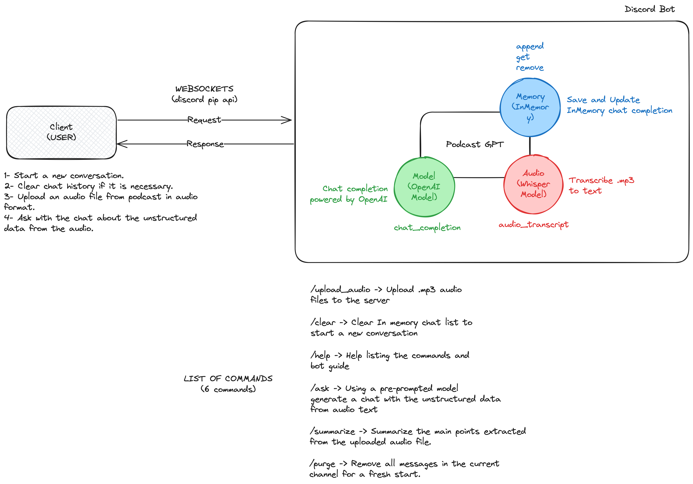

# 🤖 Podcast Agent Bot

The Podcast Agent Bot is an innovative Discord bot designed to analyze and summarize podcasts. Utilizing OpenAI's powerful GPT and Whisper models, it offers users a seamless way to interact with audio content, providing insights, summaries, and responses to queries based on the podcast's content.

## 📜 Contents

- [🤖 Podcast Agent Bot](#-podcast-agent-bot)
  - [📜 Contents](#-contents)
  - [🎯 Purpose](#-purpose)
  - [🔧 System Design and Architecture](#-system-design-and-architecture)
  - [✨ Features](#-features)
  - [🚀 Getting Started](#-getting-started)
    - [📥 Installation](#-installation)
  - [❓ How to use it?](#-how-to-use-it)
    - [📖 User Guide](#-user-guide)
    - [⌨️ Commands](#️-commands)
  - [💻 Technologies Used](#-technologies-used)
    - [🔑 OpenAI API](#-openai-api)
    - [🗣 Whisper by OpenAI](#-whisper-by-openai)
    - [🤖 Discord API for Python](#-discord-api-for-python)
  - [🤝 Contributing](#-contributing)
  - [📞 Contact](#-contact)
  - [📄 License](#-license)

## 🎯 Purpose

The creation of the Podcast Agent Bot was inspired by the challenge of consuming and retaining the wealth of information available in podcasts. Often, while listening to podcasts, taking notes and revisiting key points later can be cumbersome. This bot simplifies the process by providing tools to summarize, highlight important information, translate content, and offer an interactive Q&A feature based on the podcast, making the wealth of knowledge in podcasts more accessible and engaging.

Certainly! You can add a section to your README like this, referencing the image you've provided:

## 🔧 System Design and Architecture

The Podcast Agent Bot is architected to offer a seamless and interactive experience for Discord users to engage with podcast content. Below is an outline of the bot's system design and architecture:



- **WebSockets (Discord pip API)**: This enables real-time communication between the client (user) and the bot, ensuring a responsive user experience.

- **Client Interaction Flow**:
  1. **Starting Conversations**: Users can initiate conversations with the bot, providing context for accurate responses.
  2. **Clearing History**: The bot supports clearing chat history, allowing users to start new sessions without previous context interference.
  3. **Audio File Management**: Users can upload audio files from podcasts in supported audio formats for processing.
  4. **Chat Interactions**: The bot enables users to ask questions and engage with the content extracted from the audio.

- **Core Components**:
  - **Podcast GPT (OpenAI Model)**: Leverages GPT-4 for generating chat completions, delivering insightful interactions based on the podcast's content.
  - **Memory Management (InMemory)**: Maintains chat context through in-memory storage, supporting uninterrupted user experience.
  - **Audio Processing (Whisper Model)**: Uses OpenAI's Whisper for accurate transcription of audio content, facilitating content analysis.

- **Bot Commands**:
  - `/upload_audio`: For uploading `.mp3` audio files to the server.
  - `/clear`: To reset the in-memory chat list and start a new dialogue.
  - `/help`: For a detailed list of commands and bot usage instructions.
  - `/ask`: To prompt the bot for specific information based on the podcast's transcribed text.
  - `/summarize`: To obtain a concise summary of the podcast's key points.
  - `/purge`: To clear all messages in the channel for a clean start.

To view the design system in the repository, navigate to `docs/design-system.png`.

## ✨ Features

- **Audio Analysis**: Upload your podcast audio files and get a detailed analysis of the content.
- **Transcription**: Convert audio content into text using Whisper for further analysis.
- **Summarization**: Get concise summaries of your podcast episodes, highlighting the key points.
- **Interactive Q&A**: Ask questions about the podcast content and receive accurate answers.
- **Support for Multiple Audio Formats**: Supports mp3, wav, and ogg audio formats.

## 🚀 Getting Started

### 📥 Installation

To set up the Podcast Agent Bot for development and testing, follow these steps:

1. **Clone the Repository**
   Clone the project to your local machine:

```bash
   git clone https://github.com/your-username/podcast-agent-bot.git
   cd podcast-agent-bot
```

2. **Create a New Discord Bot Application**
   - Navigate to the [Discord Developer Portal](https://discord.com/developers/applications).
   - Click on "New Application", name your application, and then click "Create".

3. **Generate Your Discord Token**
   - In the Discord Developer Portal, select your application, go to the "Bot" tab, and click "Add Bot".
   - Under the "Token" section, click "Copy" to get your Discord bot token.
   - Set the necessary permissions for your bot to function correctly.

4. **Add Your Environment Variables**
   Configure the environment variables in your system or a `.env` file:

   ```bash
   DISCORD_TOKEN="your_discord_token"
   DISCORD_GUILD_ID=your_guild_id
   DISCORD_GUILD_CHANNEL=your_channel_id
   OPENAI_API_KEY="your_openai_api_key"
   OPENAI_GPTMODEL="gpt-4-turbo-preview"
   OPENAI_TEMPERATURE=0
   OPENAI_TOKENS=4096
   ```

5. **Install Dependencies**
   Run the following command to install the necessary dependencies:

   ```bash
   pip install -r requirements.txt
   ```

6. **Run Your Project**
   Launch the bot with the following command:

   ```bash
   python3 main.py
   ```

**Note:** To run tests, use the `pytest` command in your terminal.

## ❓ How to use it?

### 📖 User Guide

To interact with the Podcast Agent Bot effectively, follow these steps:

1. **Start a New Conversation**: Initiate your interaction with the bot to set the context.
2. **Clear Chat History (if necessary)**: Use the `/clear` command to remove old interactions and start with a clean slate.
3. **Upload Podcast Audio**: Execute the `/upload_audio [file] [language]` command to upload your podcast file in a supported format (mp3, wav, or ogg) for analysis.
4. **Analyze and Interact**: Post-upload, ask the bot specific questions about the podcast's content with the `/ask [question]` command or request a summary using `/summarize`.

### ⌨️ Commands

Utilize the following commands to interact with the bot:

- `/ask [question]`: Inquire about specific podcast content.
- `/help`: Display a list of available commands and their functions.
- `/clear

`: Clear the chat history to clean up the conversation space.

- `/upload_audio [file] [language]`: Upload an audio file for detailed transcription and analysis.
- `/purge`: Remove all messages in the current channel for a fresh start.
- `/summarize`: Summarize the main points extracted from the uploaded audio file.

This guide aims to help users navigate through the bot's functionalities efficiently, enhancing the overall user experience.

## 💻 Technologies Used

### 🔑 OpenAI API

The Podcast Agent Bot leverages the OpenAI API to process and analyze the transcribed podcast data. It uses advanced language models to generate summaries, answer questions, and provide insights into the podcast content, enhancing the user's understanding and engagement with the material.

### 🗣 Whisper by OpenAI

Whisper, a robust speech-to-text model developed by OpenAI, is used to transcribe audio files into text. This technology ensures accurate transcription of podcasts, allowing the bot to analyze and interact with the spoken content effectively.

### 🤖 Discord API for Python

The bot is integrated into Discord using the Python Discord API, which allows it to operate within a Discord server. This API facilitates the bot's interaction with users, managing commands, uploading audio files, and providing responses directly within the Discord platform.

## 🤝 Contributing

The Podcast Agent Bot is an open-source project, and contributions are welcome. Feel free to fork the repository, make your changes, and submit a pull request.

## 📞 Contact

Created by [Matias Vallejos](https://matiasvallejos.com/) - feel free to contact me:

- 🌐 [Website](https://matiasvallejos.com/)
- 🔗 [LinkedIn](https://linkedin.com/in/matiasvallejos/)
- 📁 [GitHub](https://github.com/matiasvallejosdev)

## 📄 License

This project is open source and available under the [MIT License](LICENSE.md).
